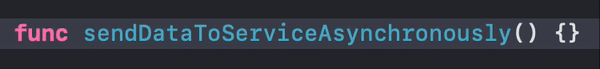

# Big bag of Xcode tips & tricks

Written on: May 1, 2023

I've been a developer for a number of years now. Primarily iOS. Over the years I've learned to use Xcode quite efficiently. I won't claim to now all the ins and outs of it but I do consider myself to know more than most. Below is a list of my learnings. Perhaps you'll find them useful.

They are grouped into categories by what they are most closely related to, however they are listed in no particular order. If you wish to integrate them into your daily workflow, I recommend choosing a few at a time and honing them in, rather than trying to jump into all of them at once.

*Word of caution: this is a rather long list :D*

## Editor

### Code snippets

Code snippets are something that you will build over time. Notice a pattern of code that you keep writing over and over again? Make it into a code snippet!

To create a code snippet, simply select a piece of code in the editor, right click it and choose `Create Code Snippet...`. That should open the library popup where you can configure your code snippet further. For each code snippet you can configure the language, platform, completion and availability scope. The language should be populated by default and I expect it to be right most of the time. Platform let's you choose which platform your code snippet should trigger on. If you're making something for iOS only, for example something using UIKit, you can choose to make it iOS only. Completion is the actual string that will trigger your code snippet to show up in the auto-complete results. Finally, availability is the scopes in which the completion string should be recognized. You can change all of these parameters later.

When creating your code snippets don't forget to use placeholders! You create a placeholder by surrounding a piece of text with `<#` and `#>`. The Xcode editor will automatically recognize and render it as a placeholder. You can either add your place holder by editing the code snippets in the library popup, or by setting them up before creating the code snippet.

You can find existing code snippets in Xcode's library. Access it by either clicking the `+` button in the top right corner or using the `Command`+`Shift`+`L` shortcut. Once there open the first tab. These should be all of the code snippets available to you, many of which are built into Xcode. Keep in mind that the tab might not show up if you don't have a source code editor open.

### Spell checker

Would you believe me if I told you that Xcode has a built in spell-checker? It's off by default too for some odd reason. To turn it on go to `Edit` -> `Format` -> `Spelling and Grammar` and turn on `Check Spelling While Typing`. Now whenever you make a typo in your source code, Xcode will highlight it and give you suggestions to fix it when you right click on it.

It even works with combined words like `thisIsSoneVariable`. The fix suggestions won't show up for these though.

### Autocomplete window size

If you're working on a project with long symbol names, you can actually resize the auto-complete window so that you can see more of the suggestions. Simply drag the window from it's trailing edge. Unfortunately it doesn't remember the size that you set so as soon as the window disappears, it'll be back to the default size the next time it pops up.

### Multi-Cursor editing

Starting in Xcode 10, you can have multiple cursors in your editor. This allows you to edit multiple spots in your source code at once.

There are a number of ways to invoke this.

- Hold `Shift` and `Control` and click somewhere in the editor to add a cursor at that place.
- Hold `Shift` and `Control` and use the up/down arrow keys to add cursors above or below the current line along the same column. Note that if the line you are moving to does not extend to the column where you are trying to add a cursor, then it will not add one there.
- Hold `Option` and drag vertically with your mouse to create multiple cursors in a vertical line. Dragging horizontally also makes a selection with those cursors. In this case, same line length rules apply as when adding cursors with the arrow keys.
- Select a bit of text and press `Command`+`Shift`+`E`. This will select the next occurrence of the text you currently have selected. By definition this places a cursor there too. Keep pressing the shortcut to select more occurrences. You can then press either left or right arrow keys to dismiss selection while preserving the cursors.

With multiple cursors, you can press escape to dismiss them. The last cursor that was created will be the one that you are left with.

### Rename

If you are not familiar with Xcode's rename functionality, it allows you to rename a symbol, such as a class, function or variable, throughout your codebase, making sure that all other references are updated. You can rename in one of two ways.

- Hold `Command` and click on the symbol. Choose `Rename` in the menu that appears.
- Right click on the symbol name then open the `Refactor` submenu and choose `Rename`.

In both cases your editor should start looking for all references to the symbol. Once all references are found, the one that you invoked the rename from will become editable. For each found occurrence you can click it to toggle whether or not that one should be renamed. Comments by are off by default. When renaming type names, matching file names are also picked up for renaming.

When renaming functions you also have the ability to rename its external argument labels. When all results have been loaded, simply click on them and start typing.

Cancel a rename at any point by pressing `Escape`.

There isn't a shortcut for this by default, but you can make on by opening Xcode's preferences and going to the Key Bindings tab. There, search for `Rename` and bind it to a shortcut. Personally I use `Shift`+`Option`+`N`.

*Personal note: I often find this feature failing, especially in larger codebases. It also does not play nice with mixed codebases where you have both Swift and Objective-C code. Often times renaming an Objective-C method may not find all of its Swift usages and vice versa. Be mindful of that.*

### Rename in scope

Similar to `Rename`, there is also `Rename in scope`. You can think of this as a light weight `Rename`.

Rename in scope allows you to rename a symbol within the current scope, whether that is within the current for-loop, function, class or file. The important thing is that it cannot go further than the current file.

This it a lot more limiting than `Rename` however it is also **a lot faster**. In my experience, most of the time it's instantaneous. It is very useful, for renaming internal function argument labels, private class/struct properties, or for anything else that you know for sure is limited to the current file.

### Vim mode

If you are an avid Vim user you may find Xcode 13's new Vim mode quite useful. You can turn it on by enabling `Vim Mode` in the `Editor` menu. I'm no Vim expert. I only really know the basics. However, I have heard that Xcode's vim support is quite limited.

### Editor shortcuts

Below are a few editor shortcuts that I use quite often.

#### Auto-generate documentation template

While editing a function, property, class or struct, use `Command`+`Option`+`/` to generate a documentation comment template above its definition.

#### Re-Indent selection

Select a piece of code and automatically indent it by using the `Control`+`I` shortcut. Use `Command`+`A` before hand to select the whole file. Keep in mind that with particularly large files this can freeze up Xcode for a few seconds (or more).

If it is not indenting correctly, either you didn't select enough code, or there is a syntax error somewhere.

#### Move line up or down

Use `Command`+`[` or `Command`+`]` to move the current line up or down.

#### Move cursor by line, token or word

If you hold down `Command` and use the left or right arrow keys, the cursor will jump to the beginning or end of the current line. Using the up and down arrow keys will take you to the beginning or end of the file.

Holding `Option` instead of `Command` while using the left/right arrow keys will move you to the beginning or end of the current token or the previous/next tokens, depending on where the cursor was. Token in this case refers to any word separated by whitespace or a punctuation symbol (brackets included). Up and down arrow keys move the cursor to the beginning or end of the current line.

These macros actually work almost everywhere in MacOS. I highly recommend you make use of them as they speed up your editing skills tremendously. Inside and outside Xcode.

One thing that you will be surprised to find in Xcode though, is the ability to move the cursor by word. Here is what I mean.

The key combination for this is `Control` and left/right arrow keys. If you go and try that you'll find that it won't work. If you use multiple macOS desktops, you'll also find that it actually jumped to a different desktop.

That's because that is a macOS shortcut for switching between desktops. The trick to making it work is to also hold down `Shift`. This will cause the text to be selected as you move the cursor. A small drawback is that once the cursor is in the right position you have to press the arrow key again to deselect it. This is the only way that I have found to make it work. However it's fairly easy to get used to and I find it invaluable when writing code.

*Note: Holding down `Shift` to select also works with just the arrow keys as well as `Command` and `Option`. I recommend you make a habit of using that, it's very handy.*

## Workflow

### Behavior sounds

One neat feature of Xcode that a lot of people don't know about is that you can customize its behavior when certain things happen. This is done in the `Behaviors` tab in Preferences. Select the event from the sidebar, that you want to configure, and then choose what you want to have happen when that event occurs. For me, I set it up to play one sound when a build or test fails, and a different sound when they succeed.

### Clear-All Issues

Unfortunately Xcode has been getting quite buggy recently with its pre-compiler. Often times it'll show inline errors and warnings that have long been resolved. These errors and warnings also show up in the issues tab, clogging up the output there.

It has gotten better in Xcode 14, but it's still not fixed completely. Which is why Xcode 14 comes with a "nuke all" option in the form of a menu button that clears the list of issues. It is located in `Product`->`Clear All Issues`. This is very useful for quickly validating your code. Just `Clear All Issues` and build again. Any new issues that pop up after that are going to be legitimate.

There is no default shortcut to it, but you can set one through `Key Bindings` in Preference if you want. I personally just press `Command`+`Shift`+`/` to bring up the Help menu, then type in "Clear". It's usually the second result.

### Display build durations

If you're curious how long each build takes, Xcode can actually display that for you. It is disabled by default, and unfortunately you won't find a GUI toggle to turn it on anywhere in Preferences. Instead you have to manually modify the preferences file, using this command:

`defaults write com.apple.dt.Xcode ShowBuildOperationDuration -bool YES`

After running this command, Xcode should start displaying the build time in the trailing side of the top "build status" strip. It is handy if you're trying to optimize build times in your project.

To turn it off, run the same command but replace the last `YES` with `NO`.

### SF Symbol Gallery

Before Xcode 14, if you wanted to browse through SF Symbols you had to download Apple's [SF Symbols app](https://developer.apple.com/sf-symbols/). You can still do that. In fact, you most likely will have to, if you want to make your own SF Symbols. However if you just need to browse, Xcode 14 has that built in now.

The feature is located in the Library, which again you can access by either clicking the `+` button in the top right, or using the shortcut `Command`+`Shift`+`L`. The last tab should present you with a list of SF Symbols. You have the option of viewing them in a grid or list. You can also start typing the name of the symbol that you're looking for. Use the mouse or arrow keys to navigate. Press enter, or double click on a result to insert its name wherever your cursor was in the editor.

This feature only seems to work in the source editor as far as I've tested. Also keep in mind that the tab might not show up if you don't have a source code editor open.

### Console output of previous runs

The last tab in the left sidebar contains a log of the operations that you've run in the current project. Typically it lists out all the times you've run tests, built the project or ran it. This will be sorted and organized by target, date and time. If you click on any of the rows, you will be taken to a log of what happened for each of those operations.

If you have an obscure build error, this is usually a good place to check that out, as it will give you a full view of what happened.

Additionally, if you want to see the log output of previous runs, simply expand the appropriate `Run` row and you should have a `Console` item in there. Clicking that should show you what was printed to the console during that run.

### Workflow shortcuts

Below is a short list of workflow related shortcuts that I use often.

#### Toggle SwiftUI previews

Use `Command`+`Option`+`Enter` to quickly open and close SwiftUI previews. This is particularly useful to me when I know I'm about to make a lot of changes to my view and I don't need them all rendered. I just dismiss the preview and go to town.

#### Restart SwiftUI previews

If ever your previews crash as a result of bad code, you can quickly restart them with `Command`+`Option`+`P`.

#### Authors

You can quickly see who authored which part of the file by enabling the authors overlay. Open the editor menu in the top right and click on `Authors`. Alternatively use the `Command`+`Shift`+`Control`+`A` shortcut to quickly toggle it.

Enabling it should give you a line by line breakdown of who touched which line of code last, along with a date and the commit message that they did it with. Essentially this is an inline Git blame.

## Navigation

### Open Quickly

If there is one thing that I wish you learn first, it is Open Quickly. You can think of it as Spotlight but for your codebase. Open it with `Command`+`Shift`+`O`. This should present you with a small search bar in the middle of the screen. Start typing the name of any symbol in your codebase and results will start loading below. Use arrow keys to navigate through them, then press `Enter` to open one. You will immediately be taken to wherever that symbol is located.

Notice how I say symbol and not file or class name. That is because this works not just for searching files but for searching code. Quickly jump to a specific function, class, variable or any other code symbol.

It will search through the standard library too, though it will prioritize code in your codebase first. However if you wanted to see the header of some standard library file, you can find it through there too.

### Jump bar

One thing that I see almost no-one use is the Jump Bar. I don't quite understand why, because I find it amazing for in-file navigation, especially if you have a rather large file.

The jump bar is located in the last part of the breadcrumbs, right above the source code editor. It goes right after the file name section and usually displays the name of the symbol that you currently have your cursor on. If you're inside a long function or class and not sure what it is called, it will show it to you there. However that's just the breadcrumbs, not the Jump Bar.

You can invoke the Jump Bar by either clicking on the last part of the breadcrumbs (the symbol name) or pressing `Control`+`6`. This will open a popup with a list of all the symbols in the current file, as well as all the `MARK:`, `TODO:` and `FIXME:` markers in the file. You can use your mouse to scroll through it and select a symbol to jump to. However, a much faster approach is to simply start typing the name of the symbol you want to jump to. Then use your arrow keys and `Enter` to jump to it. This is absolutely the fastest way to navigate through a file for me.

### Navigation Stack

The navigation stack in Xcode works very similar to the back and forth buttons in most web browsers and is actually quite helpful. Basically, each file that you open or go to in an Xcode window will be put on a stack. You can go back and forth through the stack using the left and right chevrons in the top left of the editor, right where the file tabs start.

However a much faster approach is to use the shortcuts `Command`+`Control`+`Left Arrow` and `Command`+`Control`+`Right Arrow` to go back and forth. Imagine you were following some very convoluted code logic, jumping through dozens of classes and call sites, to end up somewhere deep in the codebase. You're so deep in fact, that you're not even sure where you started. Well you can use the navigation stack to trace your steps back to where you were. Simply use the chevron buttons (or the shortcuts) to trace your steps back to where you were.

One thing to be aware of is that a lot of other IDEs and editors will place cursor position changes on the stack. What I mean is, anytime you click somewhere in the editor, that position is placed on the stack. Xcode doesn't behave like that. Instead it only puts explicit navigation actions on the stack. This includes things like opening a file from the Project Navigator or jumping to a symbol using Open Quickly or the Jump Bar.

That last part is particularly useful when working on two or more functions that are in the same file, but are far apart. Rather than scrolling back and forth between them, you can instead navigate to them all in succession using the jump bar. Then quickly switch between them using the back and forth navigation shortcuts.

Some other useful things to keep in mind is that once you go back a few times and go somewhere else, that trunk on the navigation stack is lost. So if you need to preserve your path, be mindful of that. Another useful thing to know is that each window tab in Xcode will have its own navigation stack.

*By window tab I don't mean the small file tabs that you get by opening files. I mean the big tabs that you create by pressing `Command`+`T`*

Personally, the navigation stack is an integral part of my workflow. So much so, that I bound it to the side buttons on my mouse. It allows me to move between files with barely a thought.

### Counterpart files

This feature is more useful for Objective-C or if you thoroughly test test your code. Though you can make it work for you if you fiddle with some config files within Xcode.

Similar to the back and forth navigation shortcuts, you can use `Command`+`Control`+`Up Arrow` or `Command`+`Control`+`Down Arrow` to view related files. Xcode calls these "counterparts". For most Swift code, by default that will be the auto-generated headers. I don't often have a lot of use for this, unless I'm working on a library and want to make sure I expose what I meant to expose. It is very useful in Objective-C however, since the headers there are not auto-generated and have to be written by hand.

If the source code file that you're working on has an associated test file then it will also be considered a counterpart. So long as it uses the same name with a `Tests` suffix. For example if you're working on a file called `Model.swift` and your test file is called `ModelTests.swift`, Xcode will consider them counterparts of each other.

You can customize this behavior by specifying more suffixes that should be considered counterparts. You do this with the following command.

`defaults write com.apple.dt.Xcode IDEAdditionalCounterpartSuffixes -array-add "ViewController" "ViewModel"`

Here I added two suffixes: `ViewController` and `ViewModel`, but you can add as many as you'd like. You may need to restart Xcode for these changes to take effect. To check which suffixes are currently set, use:

`defaults read com.apple.dt.Xcode IDEAdditionalCounterpartSuffixes`

To reset use:

`defaults delete com.apple.dt.Xcode IDEAdditionalCounterpartSuffixes`

### Minimap

I wouldn't call the minimap the most useful feature added to Xcode, but I do enjoy it quite a bit. You can toggle the minimap by enabling it from the Editor Options menu, similar to the Authors overlay. You can also the shortcut `Command`+`Control`+`Shift`+`M`.

The biggest help that I find from it is that it prominently shows all your `MARK:`s, along with the current scroll position. This can be useful in quickly finding certain parts in the current file.

Hovering over it with the mouse will highlight different parts of the file. Clicking on the will take you to them. Holding down `Command` while hovering will show a list of all other symbols, similar to the jump bar. Personally I don't find these two features as useful, and much prefer the Jump Bar, as it is much more keyboard friendly.

### Navigation Shortcuts

Below are a few navigation shortcuts that I use quite often.

#### File explorer

Use `Command`+`1` to quickly open the Project Navigator. You can also use the other numbers, 1 through 9, to open any of the other nine tabs in the left sidebar.

#### Reveal file in Project Navigator

If you want to see where the currently open file is in the Project Navigator, the action for that is located in `Navigate`->`Reveal in Project Navigator`. The shortcut for that is `Command`+`Shift`+`J`.

#### Tab navigation

You can move back and forth through **window** tabs using `Control`+`Tab` and `Control`+`Shift`+`Tab`. This will also work in almost any other macOS application. However in Xcode, you can also move through **file** tabs using `Command`+`Shift`+`[` and `Command`+`Shift`+`]`.

## Search

### Find Symbol/Find Call Hierarchy

The default project search functionality within Xcode works well enough. At least when what you're looking for is fairly unique, like `ScoreBoardQueryResultsViewController`. However when you need to find all usages of a public property called `title`, you might run into some trouble. Since the default search in Xcode only does simple string matching, you'll often get very cluttered results. There is a better way (and it's not RegEx).

If you right click on the symbol that you are trying to search for, then go to the `Find` submenu, you'll see three options in there.

1. First there is the `Find Selected Text in Workspace`. This will do a normal **text** search like the one that we're used to. Doing it this way may be faster than copying the text, going to the global search and pasting it there.
1. Second we have the `Find Selected Symbol in Workspace`. This will perform a **symbol** search. Going back to our example, if you were to perform this kind of search on our `title` property, defined on some `SpecialViewController` class, it won't just find any text that matches `title`. It will actually search for instances of that specific `title` property, when it belongs to an instance of `SpecialViewController` class. The search results will consist of all usages of the symbol, plus a declaration. Usages are defined as follows;
    - For properties it will find you all places where it is read or written
    - For functions it will find you all places where the function is called, or is passed as data
    - For types it will find all references to said type, whether that is instantiation, a constraint or subclassing.
1. Lastly there is `Find Call Hierarchy`. This is typically used with function and it works a little different from the other two options. When you use this on a function your results will form a tree. Typically you will start at one or more roots. These are all the immediate call sites of your function. If you expand any of those, this will in turn show you the call sites of the second level of branches. If you expand the third, you'll see a forth, and so on until you reach a leaf of some sort. This is typically a `viewDidLoad`, a `viewWillAppear` or some kind of `main`. This is better explained with an example.

In the screenshot above we see a Call Hierarchy search of an instance function called `shuffledLabel(accidentals:)` defined a type called `Note`. Looking at the first level we see that it is used in the same type in two static functions called `random(in:accidentals:)` (These are overrides, they have different types of parameters). We can see that the first one has no more branches so it is a leaf. However the second does have branches, and it is itself used in two more places. First in a function called `createRound` on a type called `ChordGuessingGame` and then in a function of the same name on a type called `IntervalGuessingGame`. I think this should be enough to show you the power of this search.

One thing to keep in mind is that these alternate searches will change your search settings and you'll either need to use these right-click options or change them manually next time you need to search. Below is a demonstration of how to change it manually.

*Note: `Find Selected Symbol in Workspace` may often not find all usages of a symbol in mixed code codebases. I think this is due to the differences in selector syntax between Swift and Objective-C. Keep that in mind when using it.*

### Breakpoints as bookmarks

This is a trick I often use when I start working on an already established codebase and I'm still getting my bearings. If you have a place in your codebase that you want to bookmark, you can set a disabled breakpoint on it. To disabled a breakpoint simply click on it after creating it. Now navigate to the breakpoints tab (2nd from the right, `Command`+`8`) in the left sidebar and you should see it there, along with any other breakpoints you've set.

You can take this further by double clicking on the breakpoint and giving it a name. Unfortunately this name will not show up in the list, so I usually use the name field to provide some context to the breakpoint if needed.

### Search Shortcuts

#### File vs. Project search & replace

Use `Command`+`F` to trigger a search in the current file. Use `Command`+`Shift`+`F` to trigger a search in the workspace. Use `Option` with either of those shortcuts to do a find & replace instead of just a search.

#### Next Result

When performing a file search use `Command`+`G` to quickly have your cursor jump to the next result.

## Interface Builder

### Select layer

When you're working with a scene that has a very complicated view structure, it can be difficult to select just the right view. However Interface Builder has a very nifty trick for us. Hold down `Control`+`Shift` and click on the area containing the view that you want to select. This should open a popup of all the layers that appear under your mouse. Scrolling through that should highlight the views inside the scene. Then simply click the view that you want from the list and it will be selected.

### Distance to view

Similarly, if you're working on a design and need to verify that all numbers are correct, in terms of spacing, Interface Builder has a very useful trick for us. Select one of the views and hover your mouse over the other, while holding down `Option`. You should see distances along all axes between the two views.

Here I have selected the yellow view and I'm hovering over the red view while holding down `Option`. We can see that the distance from the edges of the yellow view to the edges of the red view is 20 points along the vertical axis, and 56 points along the horizontal axis. In this example I'm measuring distances between a parent and child, however this works across view branches too.

## Debugging

### LLDB Console

One of the best debugging skills you can learn for iOS is how to use the LLDB console. There are a lot of other articles that explain it better than I could. I personally learned about it through [this one](https://www.objc.io/issues/19-debugging/lldb-debugging/), from [objc.io](https://www.objc.io). It goes over the LLDB console as well as a few other tricks which I will talk about briefly here. I strongly encourage you to give it a read. It's quite long and it goes in-depth, but I highly recommend it. I guarantee that you'll learn a few valuable skills.

The LLDB console is activated by hitting a breakpoint. Once activated you are given a console that you can put commands into, to prompt the current state of your application. The console is signified by the green `(lldb)` prompt in your output console.

Now you might say, "I can already do that in the debugger panel, it show me all my variables and everything! This just seems like more typing". To this I'll say two things.

- That panel is just a wrapper around the LLDB console. It is useful if you want to use a mouse and quickly glance at some thing. However for a keyboard workflow, direct access to the LLDB console is much faster. Additionally it is much easier to drill down into data through the text console, rather than using the drill down controls in the debug panel. By drill down I mean accessing things like `viewModel.service.items[0].id` for example.
- In my experience, the debugging panel has a habit of showing wrong values. Especially if you're on a more complicated codebase, or you're doing something that is not very straightforward, when it comes to data storage. I can tell you for a fact that if you use [Realm](https://realm.io) in your project, the database objects will almost never have the right values showing up in their properties.

The console has many commands that you can use. Each one usually has a full version, for example `print` but most of the time you use its shorthand variant, in this case just `p`.

I mostly find myself using these commands:

- `e` for `expression`. This command is used to execute a statement. Any statement in the language of the current breakpoint context is valid. You can try to print something using `print` or `NSLog`. You can try to call a function or even set some variables to change the state of your program mid-run. Keep in mind that if your breakpoint stopped in Swift code, then the console will expect to see Swift code after the `e` or `expression` prompt. If it stopped in Objective-C code then you'll have to write Objective-C statements.
- `p` for `print`. This is actually just an alias to `e --`. So in essence it is a variation of the `expression` command, fine tuned for printing its output. That means that you can still give this command expressions to run, even if they modify state like setting variables. The difference is that you will not be able to pass in any extra flags or arguments that you can pass to `expression`.
- `po` for `print object`. This is also just an alias but this time to `e --O --`. This makes it behave pretty much the same as `print`, except right before printing the result, it will check if that result is an Objective-C object (subclass of NSObject) and if it is, it will print print the result of its `description` method instead of trying to read into the object. This is handy for when you're working with complex objects like `NSArray`.
- `c` for `continue` will release the current breakpoint. This is equivalent to pressing the `Resume` button (1 from the screenshot below) in the debugger actions strip.
- `n` for `next` will move to the next executable statement. This is equivalent to pressing the `Next` button (1 from the screenshot below) in the debugger action strip.

The beauty of these commands is that they work with any expression. You can access some deeply nested property or call a function and print out the results. You can't get that from the debugger panel.

### Conditional breakpoints

When creating a breakpoint, you can double click on it to open its options. Inside of the options popup, you can use the `Condition` field to control when this breakpoint should trigger. Provide a boolean expression which should control whether or not this breakpoint should trigger. This is very useful in places where your code executes more than once, but you only care about a very specific case. If you can provide a meaningful condition then the debugger will automatically filter out the other triggers.

### Breakpoint actions

Breakpoint actions are lldb commands that you can attach to breakpoints and have them run as soon as the breakpoint is hit. This can tremendously speed up debugging. They're covered in more detail in [this article](https://www.objc.io/issues/19-debugging/lldb-debugging/), but I'll go over them here very quickly. In essence you can double click on any breakpoint, and in the popup that opens, press the `Add Action` button to create an action. By default the action is configured to be a `Log Message`, so you can put a code expression in there, and the result of that expression will be printed to the console. Alternatively, you can change the action using the dropdown to a `Debugger Command`, and now you can execute an LLDB debugger command. Every time the breakpoint is hit that command will automatically be executed. You can create ad-hoc automations, by checking the `Automatically continue after evaluation actions` checkmark to have your breakpoint execute the actions and resume automatically.

### Output console

If you're doing print statement debugging (which has its places), you can save yourself a lot of time and work by knowing how to filter the console. I'm sure you know that you can search the console output by focusing it (click it), and using the usual `Command`+`F` shortcut.

You can also clear the current contents either by clicking the trash button in the bottom right or by using the `Command`+`K` shortcut. This is useful when what you're debugging comes at a later point in the app's life cycle. Get to a point right before your prints start and clear the console to reduce the amount of noise in there.

You can also remove a lot of noise from your console output by using the filter functionality. This works best when you give of your debug print statements a common prefix (or suffix).

### Debugging Shortcuts

#### Toggle breakpoint on line

Use `Command`+`\` to quickly toggle a breakpoint on the current line.

#### Toggle debug area

Use `Command`+`Shift`+`Y` to quickly hide and show the debug area. It usually pops up automatically when you're running and the app starts printing something to the console (which you can configure in the `Behaviors` tab in Preferences btw). But it's a good idea to hide it if you're not running anything anymore and just need to code.

#### Focus on output console

Using `Command`+`Shift`+`C`, you can bring focus to the output console. From there you can either start typing LLDB commands or use `Command`+`F` to start searching through the console output. Not the biggest shortcut, but good for a keyboard oriented workflow.

Sources
-------

A lot of these were just written by me from memory. I also looked at some lists online to remind myself of what I know. Can't always recall everything on the spot. I won't claim to know everything though, I definitely learned some new things from these lists.

- [Xcode tips and tricks – part one | Hacking with Swift](https://www.hackingwithswift.com/articles/166/xcode-tips-and-tricks-part-one)
- [Xcode tips and tricks – part two | Hacking with Swift](https://www.hackingwithswift.com/articles/168/xcode-tips-and-tricks-part-two)
- [Xcode tips and tricks – part three | Hacking with Swift](https://www.hackingwithswift.com/articles/171/xcode-tips-and-tricks-part-three)
- [Xcode tips and tricks – part four | Hacking with Swift](https://www.hackingwithswift.com/articles/176/xcode-tips-and-tricks-part-four)
- [37 Xcode Tips and Shortcuts | Snowdog](https://snow.dog/blog/how-to-speed-up-your-daily-development-37-xcode-tips-and-shortcuts)
- [Set up Counterpart suffixes to make file movement a bit easier | 9to5Tutorials](https://9to5tutorial.com/xcode-set-up-counterpartsuffixes-to-make-file-movement-a-bit-easier)
- [Dancing in the Debugger — A Waltz with LLDB | objc.io](https://www.objc.io/issues/19-debugging/lldb-debugging/)

<link rel="stylesheet" href="/css/styles.css?v=1.0">
