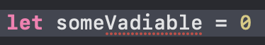

# Big bag of Xcode tips & tricks

Written on: April 21, 2023

I've been a developer for a number of years now. Primarily iOS. Over the years I've learned to use Xcode quite efficiently. I wont claim to now all the ins and outs of Xcode but I do consider myself to know more than most. Below is a list of my learnings. Perhaps you'll find it useful too.

They are grouped into categories by what they are most closely related to, however they are listed in no particular order. If you wish to integrate them into your daily workflow, I recommend choosing a few at a time and honing them in, rather than trying to jump into all of them at once.

*Word of caution: this is a rather long list :D*

---

## Editor

### Code snippets

Code snippets are something that you learn to build over time. Notice a pattern of code that you find yourself writing over and over again? Make it into a code snippet!

To create a code snippet, simply select a piece of code, right click it and choose `Create Code Snippet...` from the menu. One could also employ Xcode's placeholder to make your snippets even more powerful. You can create a placeholder at any time by surrounding a piece of text with `<#` and `#>`. The Xcode editor will automatically recognize and render it as a placeholder.

You can find existing code snippets in Xcode's library. Access it by either clicking the `+` button on the top right or using the `Command`+`Shift`+`L` shortcut. Once there open the first tab. These should be all of the code snippets available to you.

### Spell checker

Would you believe me if I told you that Xcode has a built in spell-checker? It's off by default too for some odd reason. To turn it on go to `Edit` -> `Format` -> `Spelling and Grammar` and turn on `Check Spelling While Typing`. Now whenever you make a typo in your source code, Xcode will highlight it and give you suggestion to fix it when you right click on it.

It even works for combined words like `thisIsSoneVariable`.

### Autocomplete window size

If you're working on a project with long symbol names, you can actually resize the auto-complete window so that you can see more of the suggestions. Simply drag the window from it's trailing edge. Unfortunately it doesn't save the size that you set, and as soon as the window disappears, it'll be back to the default size the next time it pops up.

### Multi-Cursor editing

Starting in Xcode 10, you can now have multiple cursors in your editor. This allows you to edit multiple spots in your source code at once.

There are a number of ways to invoke this.

- Hold `Shift` and `Control` and click somewhere in the editor to add a cursor at that place.
- Hold `Shift` and `Control` and use the up/down arrow keys to add cursors above or below the current line along the same column. Note that if the line you are moving to does not extend to the column where you are trying to add a cursor, then it will not add one there.
- Hold `Option` and drag vertically with your mouse to create multiple cursors in a vertical line. Dragging horizontally also makes a selection with those cursors. In this case, same line length rules apply as when adding cursors with the arrow keys.
- Select a bit of text and press `Command`+`Shift`+`E`. This will select the next occurrence of the text you currently have selected. By definition this places a cursor there too. Keep pressing the shortcut to select more occurrences.

While having multiple cursors, you can press escape to dismiss them. The last cursor that was created will be the one that you are left with.

### Rename

If you are not familiar with Xcode's rename functionality, it allows you to rename a symbol, such as a class, function or variable, throughout your codebase, making sure that all other references are updated. You can rename in one of two ways.

- Hold `Command` and click on the symbol. Choose `Rename` in the menu that appears.
- Right click on the symbol name and choose `Rename` from the `Refactor` submenu.

In both cases your editor should start looking for all references to the symbol. The one that you invoked the rename from will become editable once all references are found. For each found occurrence you can click it to toggle whether or not that one should be renamed.

When renaming functions you also have the ability to rename its external argument labels. When all results have been loaded, simply click on them, at the top result to begin editing them.

Cancel a rename at any point by pressing `Escape`.

You can bind this functionality to a keyboard shortcut by opening Xcode's preferences and going to the Key Bindings tab. There, search for `Rename` and bind it to a shortcut. Personally I use `Shift`+`Option`+`N`.

*Personal note: I often find this feature failing, especially in larger codebase. It also does not play nice with codebases where you have mixed Swift and Objective-C code. Often times renaming an Objective-C method may not find all Swift usages of it and vice versa. Use at your own risk.*

### Rename in scope

Similar to `Rename`, there is also `Rename in scope`. You can think of this as `Rename`'s little sibling.

Rename in scope allows you to rename a symbol within the current scope, whether that be within the current for-loop, function, class or file. The important thing is that it cannot go further than the current file.

This it a lot more limiting than `Rename` however it is also a lot faster. In my experience instantaneous, most of the time. It is very useful, for renaming internal function argument labels, private class/struct properties, or in times when you are certain that the symbol you are trying to rename is only used within the current file.

### Vim mode

If you are an avid Vim user you may find Xcode 13's new Vim mode quite useful. You can turn it on by enabling `Vim Mode` in the `Editor` menu. I'm no Vim expert. I only know the very basics. However, I have heard that Xcode's vim support is quite limited.

### Editor shortcuts

Below are a few editor shortcuts that I use quite often.

#### Auto-generate documentation template

While editing a function, property, class or struct, use `Command`+`Option`+`/` to generate a documentation comment above its definition.

#### Re-Indent selection

Select a piece of code and automatically indent it by using the `Control`+`I` shortcut. Use `Command`+`A` before hand to select the whole file. Keep in mind that with particularly large files this can freeze up Xcode for a few seconds (or more).

If it is not indenting correctly, then either you didn't select enough code, or there is a syntax error, somewhere in your selection.

#### Move line up or down

Use `Command`+`[` or `Command`+`]` to move the current line up or down.

#### Move cursor by line, token or word

If you hold down `Command` and use the left or right arrow keys, the cursor will jump to the beginning or end of the current line. Using the up and down arrow keys will take you to the beginning or end of the file.

Holding `Option` instead of `Command` will move it to the beginning or end of the current token or the previous or next tokens. Token in this case refers to any word separated by whitespace or a punctuation symbol (brackets included). Up and down arrow keys move the cursor to the beginning or end of the current line.

These macros actually work almost everywhere in MacOS. I highly recommend you make use of them as they speed up your editing skills tremendously. Inside and outside Xcode.

One thing that you will be surprised to find in Xcode though, is the ability to move the cursor by grammatical word. Here is what I mean.

The key combination for this is `Control` and left/right arrow keys. If you go and try that you'll find that it wont work. If you use multiple desktops, you'll also find that it actually jumped to a different desktop.

That's because that is a macOS shortcut for switching between desktops. The trick to making it work is to also hold down `Shift`. This will cause the text to be selected as you move the cursor. A small drawback is that once the cursor is in the right position you have to press the arrow key again to deselect it. This is the only way that I have found to make it work. However it's fairly easy to get used to and I find it invaluable when writing code.

*Note: Holding down `Shift` to make a selection also works with just the arrow keys as well as `Command` and `Option`. I recommend you make use of that, it's very handy.*

---

## Workflow

- Sound when build succeeds/fails
- Clear-All Issues
- Display build time duration
  - defaults write com.apple.dt.Xcode ShowBuildOperationDuration -bool YES
- SF Symbol Gallery is built into Xcode now
- Cmd+Alt+Enter SwiftUI previews shortcut
- Cmd+Alt+P to restart previews
- Cmd+Ctl+Shift+A Toggles blame
- Cmd+\ to toggle breakpoint on line

## Navigation

- Open Quickly
  - Open quickly can also go to symbols, not just files
- Jump bar (Ctl+6)
- Sidebar navigation (Cmd+1)
- Ctl+Alt+Left/Right Arrow
- Ctl+Alt+Up/Down Arrow (More useful with ObjC or if you have Tests with the same name)
  - Can be modified to scroll through more types of file
- Cmd+Shift+J Reveal current file in the Project Navigator
- Cmd+Shift+[ or Cmd+Shift+] to move the left or right tab
- Minimap
  - Cmd+Ctl+Shift+M Toggles minimap
  - MARK: comments show up on there

## Search

- Search Symbol/Call Hierarchy
- File Search (Cmd+F) vs Project Search (Cmd+Alt+F)
- You can give breakpoint a name, and disable them. This way they act as sort of bookmarks in the code
- Cmd+G to select next search result

## Storyboards

- Ctl+Shift+Click on a view in storyboard and it will let you select any view layered under your cursor
- While a view is selected, hold option and hover on another view to see the distance to it

## Debugging

- Cmd+Shift+Y to toggle the debug console
- Cmd+Shift+C to focus on the output console
- Cmd+K to clear the output console
- lldb commands
  - p vs po
  - e
  - Link to https://www.objc.io/issues/19-debugging/lldb-debugging/
- Watchpoints

<link rel="stylesheet" href="/css/styles.css?v=1.0">